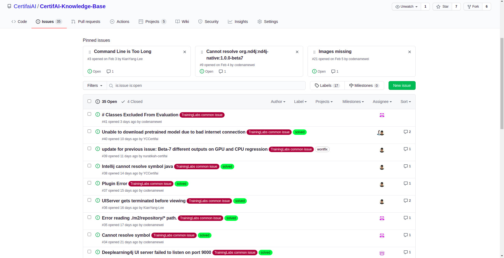
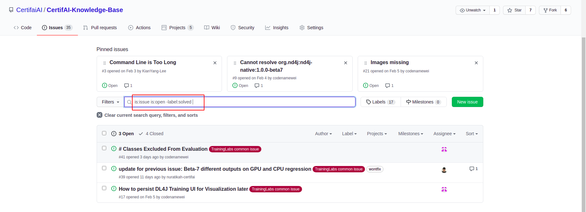

# Looking for unsolved problem
Some problem may not be assigned to a specific contributor to take in charge of...\
To whom may want to solve more problems than what you were assigned. You can try to look for the unsolved issue.

## Steps to look for unsolved issue

### Step 1: Go to Issue Page
[Issue Page](https://github.com/CertifaiAI/CertifAI-Knowledge-Base/issues)


### Step 2: Make use of Filter
Enter the following query to filter out solved issues
```aidl
is:issue is:open -label:solved 
```


### Step 3: Solve more problem
