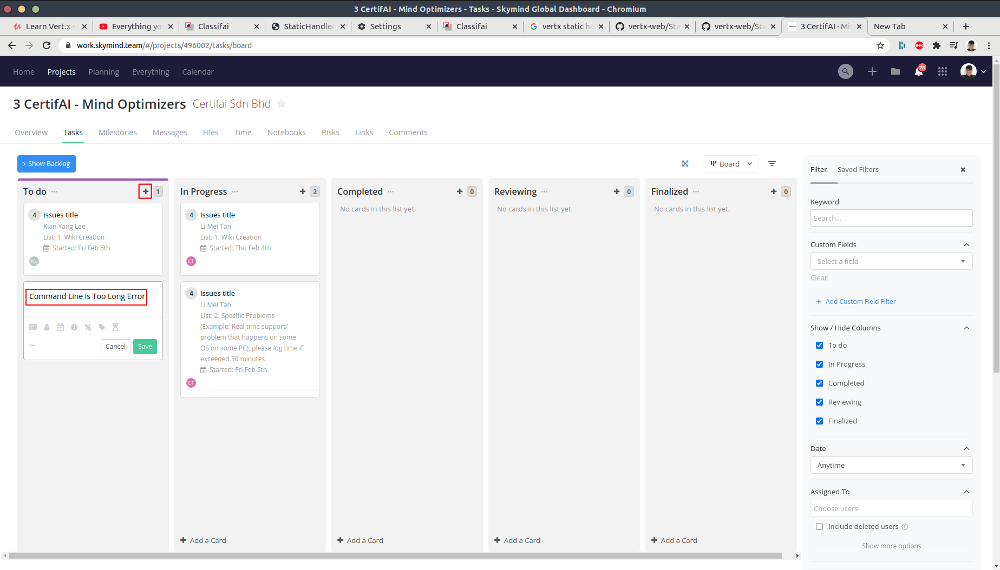
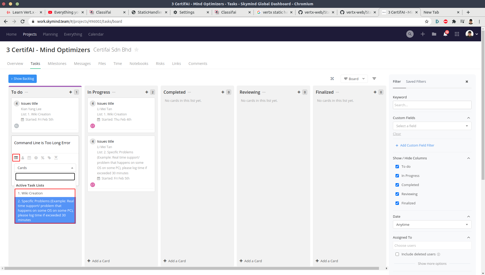

# Mind Optimizer
Mind Optimizer is a CertifAI project in teamwork project, which aim to help engineers to **improve their ability** of **problem identification** and **problem solving** through supporting users with their problem in discord and other channels.

## Tutorial
This tutorial is aimed to walkthrough you about how to make use of the teamwork project platform to give you credits on taking initiative on helping others.

### Step 1 : Open Mind Optimizer Project in Teamwork Project

### Step 2 : Click go the task page and select view as list

### Step 4 : Select the task from task list that you are doing

- Wiki Creation
- Specific Problems (Example: Real time support/ problem that happens on some OS on some PC)
  

### Step 5 : Add a task with the name of the issue title, assign yourself 

### Step 6 : Click the ... button on the left side of your task then click the *Add Subtask from Template* button

### Step 7 : Search for *CerfifAI Wiki Creation / Specific Problem* and click apply template

### Step 9 : Add it to a column 

- To do
- In progress
- Completed
- Reviewing
- Finalized
  

### Step 10 : Provide info required in the template / click the tick when done