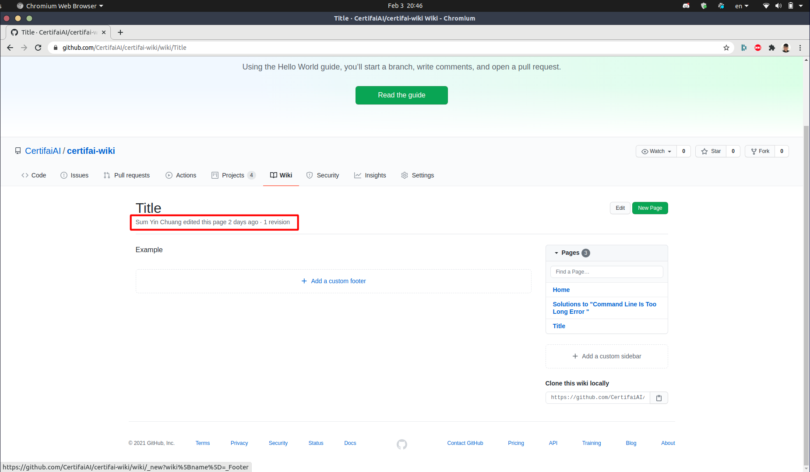

# Progress Tracking
Method to give credits to person who take initiative for answering common issue and providing support to general users.

### 1. Answering Common Issue
Upon answering questions, PIC can log time in *Teamwork Projects* by providing link of page as a proof in the comment. There will be a record of who created and edited the page as shown in the image below.

  

### 2. Supporting Users in Discord
After supporting users, PIC can log time in *Teamwork Projects* by providing (**the message link if it's in public channel / screenshot if it's in direct message**)