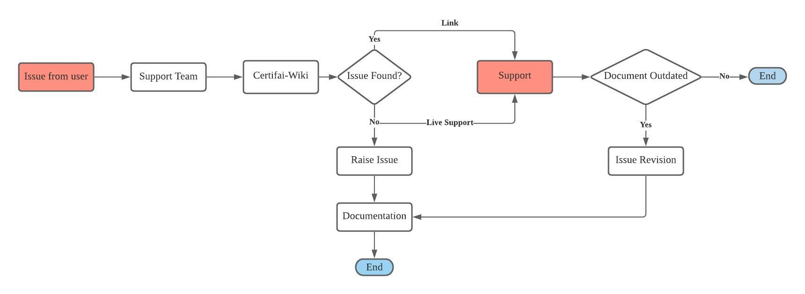
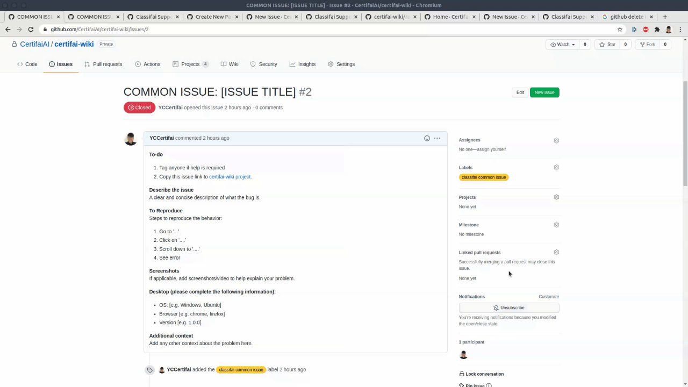
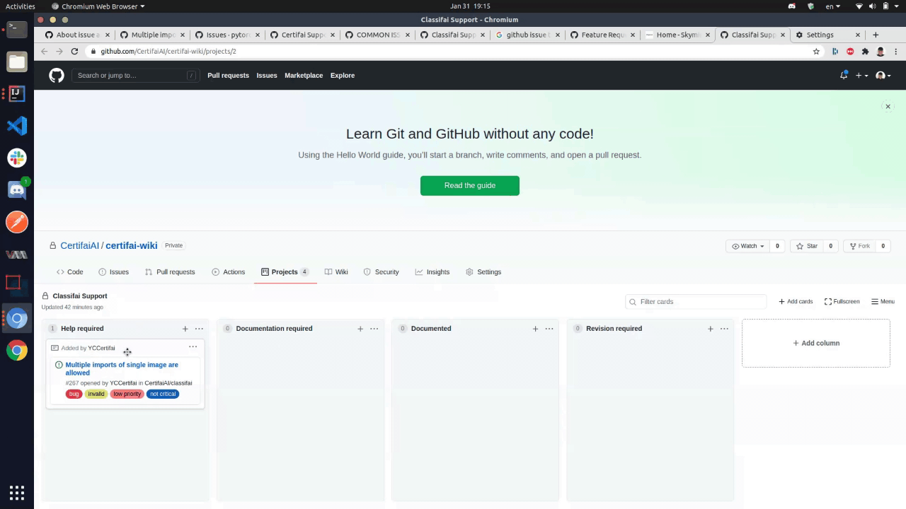
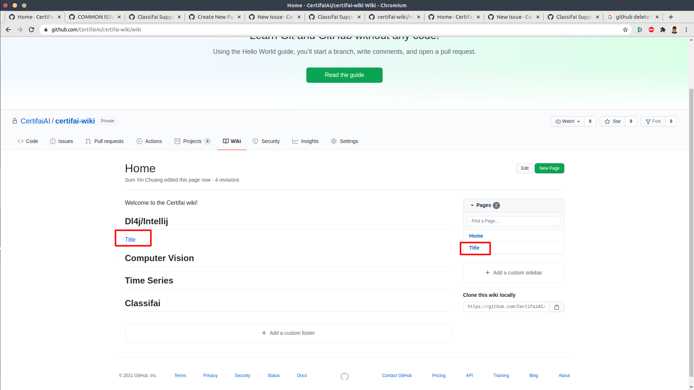

# certifai-wiki

This is a documentation of issues that are faced by users. It aims to assist certifai support team to answer repeatedly asked questions by providing properly documented links.

There are 4 categories:
1. ClassifAI 
2. TrainingLabs
3. Time series labs
4. Computer vision issues

## Process flow

  

# Instruction of using the platform

Please follow the instuctions while raising an issue. This will ensure the issue raised will be documented and traced properly.

### Step 1 : Raise the issue at the right place
Following links will lead you to the issue template for raising issue.
- [TrainingLabs](https://github.com/CertifaiAI/certifai-wiki/issues/new?assignees=&labels=TrainingLabs+common+issue&template=traininglabs-common-issue.md&title=COMMON+ISSUES%3A+%5BISSUE+TITLE%5D)
- [Computer Vision](https://github.com/CertifaiAI/certifai-wiki/issues/new?assignees=&labels=computer+vision+common+issue&template=computer-vision-issue.md&title=COMMON+ISSUE%3A+%5BISSUE+TITLE%5D)
- [Time Series Labs](https://github.com/CertifaiAI/certifai-wiki/issues/new?assignees=&labels=time-series-labs+common+issue&template=time-series-labs-common-issue.md&title=COMMON+ISSUE%3A+%5BISSUE+TITLE%5D)
- [Classifai](https://github.com/CertifaiAI/certifai-wiki/issues/new?assignees=&labels=classifai+common+issue&template=classifai_common_issue.md&title=COMMON+ISSUE%3A+%5BISSUE+TITLE%5D)

Provide the information as required in the template.

### Step 2 : Put the issues under the right project
Following links will lead you to the related project.
- [TrainingLabs Support](https://github.com/CertifaiAI/certifai-wiki/projects/5)
- [Computer Vision Support](https://github.com/CertifaiAI/certifai-wiki/projects/4)
- [Time Series Labs Support](https://github.com/CertifaiAI/certifai-wiki/projects/3)
- [Classifai Support](https://github.com/CertifaiAI/certifai-wiki/projects/2)

Add the right project to the issue

  

There are four columns in each project. Please place them at the right column. 
1. The issue with help/solution required will put under *help required*
2. Answered issues but not documented will put under *documented required*. Whenever a document is put in this column, make sure the issue is closed.

*How to move project from one column to another*

  

### Step 3 : Documentation
All answered issues must be documented properly in [wiki](https://github.com/CertifaiAI/certifai-wiki/wiki) with clear instructions/ screenshots. The documents are aimed to solve users problem without extra human assistant.

1. Copy the title from project that is in the *documentation required* column
2. Make a new page with same title
3. Document the answer in the way that is easy to understand
4. Edit the main page of wiki. Put it under the right category as the format: "[Title] (link to the document)"

  

5. In the project, move to *documented* category.

### Step 4 : Revision required
If anyone finds a documentation is outdated/ not helpful, please follow steps below.

**Case 1**
1. If you know the answer, edit it.
2. End of the story.

**Case 2**
1. If you do not know the answer, reopen the issue, move it to *revision required* column, tag someone you think may help you.
2. Once it is answered, move it to documentation required and close the issue. Wait for PIC to document it.
