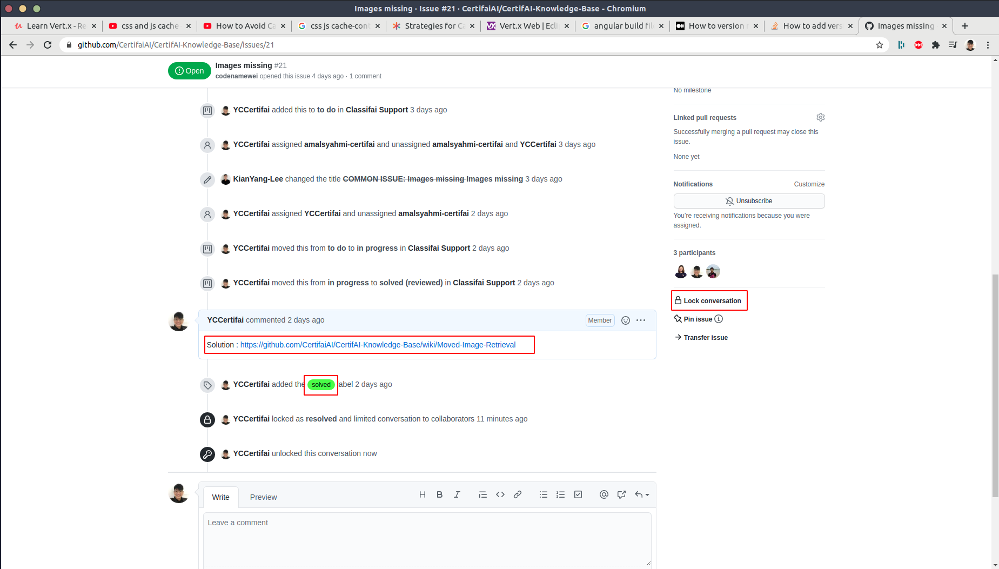

# CertifAI-Knowledge-Based

This is a documentation of issues that are faced by users. It aims to assist CertifAI support team to answer repeatedly asked questions by providing properly documented links.

There are 5 categories:
1. ClassifAI 
2. TrainingLabs
3. Time series labs
4. Computer vision issues
5. Learn-Java-the-CertifAI-Way 

## Process flow


# Supporting a user with an Issue
### Step 1: Problem Identifying

Here's a [Supporting Guidelines](https://github.com/CertifaiAI/CertifAI-Knowledge-Base/blob/main/SupportGuidelines.md) that may help you to identify user's problem.

### Step 2: Check for Solutions in wiki

List of solutions are provided in [wiki](https://github.com/CertifaiAI/certifai-wiki/wiki). 

### Step 3: Reply to user

- **If solution found in wiki**, you can reply the user with the link.

- **If solution not found in wiki**, [raise an issue](https://github.com/CertifaiAI/CertifAI-Knowledge-Base#raising-issue) first, then send the issue link to user. Once documentation is ready in wiki, inform the user.

Here's a [reply template](https://github.com/CertifaiAI/CertifAI-Knowledge-Base/wiki/Message-Template-for-Support) you can refer. It's optional to use this, but remember to be polite and professional.
# Instruction of using the platform

Please follow the instuctions while raising an issue. This will ensure the issue raised will be documented and traced properly.


## Raising issue
Following links will lead you to the issue template for raising issue.
- [TrainingLabs](https://github.com/CertifaiAI/certifai-wiki/issues/new?assignees=&labels=TrainingLabs+common+issue&template=traininglabs-common-issue.md&title=COMMON+ISSUES%3A+%5BISSUE+TITLE%5D)
- [Computer Vision](https://github.com/CertifaiAI/certifai-wiki/issues/new?assignees=&labels=computer+vision+common+issue&template=computer-vision-issue.md&title=COMMON+ISSUE%3A+%5BISSUE+TITLE%5D)
- [Time Series Labs](https://github.com/CertifaiAI/certifai-wiki/issues/new?assignees=&labels=time-series-labs+common+issue&template=time-series-labs-common-issue.md&title=COMMON+ISSUE%3A+%5BISSUE+TITLE%5D)
- [Classifai](https://github.com/CertifaiAI/certifai-wiki/issues/new?assignees=&labels=classifai+common+issue&template=classifai_common_issue.md&title=COMMON+ISSUE%3A+%5BISSUE+TITLE%5D)
- [Learn-Java-The-Certifai-Way](https://github.com/CertifaiAI/CertifAI-Knowledge-Base/issues/new?assignees=&labels=TrainingLabs+common+issue&template=learn-java-the-certifai-way-common-issue.md&title=%5BISSUE+TITLE%5D)

### What to Fill up in Issue Template


1. Title :  must be **short** and **concise**.
2. Assignees : Assign the issue to someone. It's either yourself, or anyone is responsible.
3. Content: Provide the information as required in the template.
4. Submit the issue first.
5. Projects : Assign the related project as instructed in the *gif* below. Or, add it manually in [project](https://github.com/CertifaiAI/CertifAI-Knowledge-Base#projects)


**How to add issue manually in project**


## Projects
Following links will lead you to the related project.
- [TrainingLabs Support](https://github.com/CertifaiAI/certifai-wiki/projects/5)
- [Computer Vision Support](https://github.com/CertifaiAI/certifai-wiki/projects/4)
- [Time Series Labs Support](https://github.com/CertifaiAI/certifai-wiki/projects/3)
- [Classifai Support](https://github.com/CertifaiAI/certifai-wiki/projects/2)
- [Learn-Java-The-Certifai-Way Support](https://github.com/CertifaiAI/CertifAI-Knowledge-Base/projects/6)

There are four columns in each project. Please place them at the right column. 
-  **to do**
   
   The issue that needed to be solved will be putting under this column.
-  **in progress**
   
   Issue with solution is still under preparation will be putting under this column. 
-  **under revision**

   Solution prepared that requires review / revision will be puttting under this column. **Tag** the senior engineers you would like them to review your solution.
-  **solved (reviewed)**
   
   Solution upon approved will be putting under this column.

**How to move project from one column to another**


## Documentation
All answered issues must be documented properly in [wiki](https://github.com/CertifaiAI/certifai-wiki/wiki) with clear instructions/ screenshots. The documents are aimed to solve users problem with minimal human assistant.

1. Create a new page


2. Name the title as concise as possible. 

*Example*: To solve issue **Command Line is too long error**, the name of solution would be **Shorten Command Line**


3. Document the answer in the way that is easy to understand. You can follow the guidelines from the [template given](https://github.com/CertifaiAI/certifai-wiki/wiki/Wiki-Page-Template). In this step, you'll probably face a **problem on uploading media**. We have a [walkaround](UploadMedia.md) for you.


4. After preparing the solution, edit the main page of wiki. 


5. Put a link to your solution under the right category as the format: 
   ```
   [Title](link to the page)
   ```
   

   *result*


6. In the project, move the issue to *under revision* / *solved (reviewed)* column.


7. Paste the solution link to the issue. Then add a *solved* label to the solved issue. Lock the conversation.


## Revision required
If anyone finds a documentation is outdated/ not helpful, please follow steps below.

**Case 1**
1. If you know the answer, edit it.
2. End of the story.

**Case 2**
1. If you do not know the answer, move it to *under revision* column, tag someone you think may help you.
2. Once it is answered and well documented, move it back to *solved (reviewed)* column.

## Mind Optimizer 
Mind Optimizer is a CertifAI project in teamwork project, which aim to help engineers to **improve their ability** of **problem identification** and **problem solving** through supporting users with their problem in discord and other channels.

[Walkthrough](https://github.com/CertifaiAI/CertifAI-Knowledge-Base/blob/main/MindOptimizer.md)