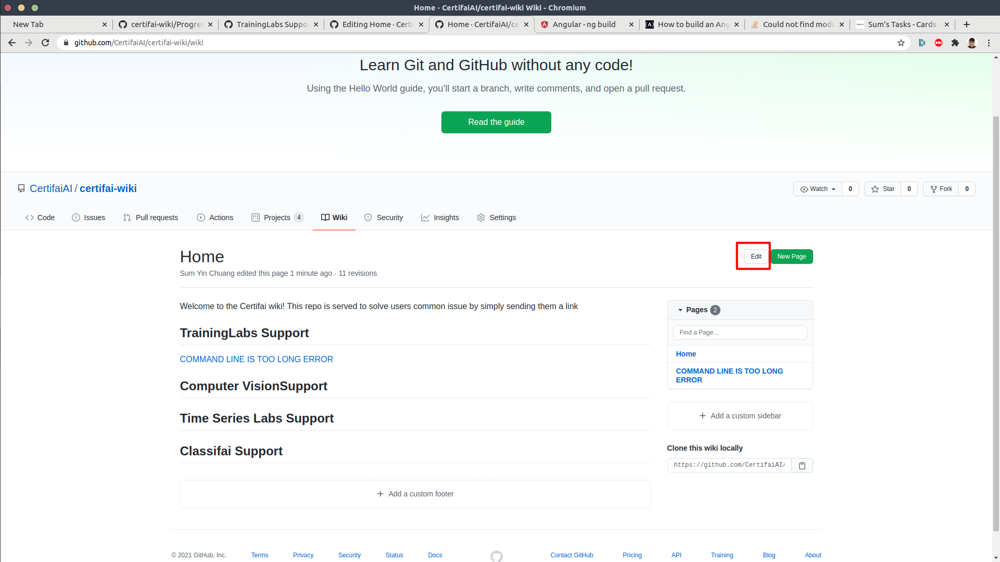

# certifai-wiki

This is a documentation of issues that are faced by users. It aims to assist certifai support team to answer repeatedly asked questions by providing properly documented links.

There are 4 categories:
1. ClassifAI 
2. TrainingLabs
3. Time series labs
4. Computer vision issues

## Process flow
<p align="center">
  
</p>

# Instruction of using the platform

Please follow the instuctions while raising an issue. This will ensure the issue raised will be documented and traced properly.

##Raising issue
Following links will lead you to the issue template for raising issue.
- [TrainingLabs](https://github.com/CertifaiAI/certifai-wiki/issues/new?assignees=&labels=TrainingLabs+common+issue&template=traininglabs-common-issue.md&title=COMMON+ISSUES%3A+%5BISSUE+TITLE%5D)
- [Computer Vision](https://github.com/CertifaiAI/certifai-wiki/issues/new?assignees=&labels=computer+vision+common+issue&template=computer-vision-issue.md&title=COMMON+ISSUE%3A+%5BISSUE+TITLE%5D)
- [Time Series Labs](https://github.com/CertifaiAI/certifai-wiki/issues/new?assignees=&labels=time-series-labs+common+issue&template=time-series-labs-common-issue.md&title=COMMON+ISSUE%3A+%5BISSUE+TITLE%5D)
- [Classifai](https://github.com/CertifaiAI/certifai-wiki/issues/new?assignees=&labels=classifai+common+issue&template=classifai_common_issue.md&title=COMMON+ISSUE%3A+%5BISSUE+TITLE%5D)

### What to Fill up in Issue Template
<p align="center">
  
</p>

1. Title :  must be **short** and **informative**.
2. Assignees : Assign yourself as the assignee
3. Content: Provide the information as required in the template.
4. Submit the issue first.
5. Projects : Assign the related project as instructed in the *gif* below.

<p align="center">
  
</p>

### Step 2 : Projects
Following links will lead you to the related project.
- [TrainingLabs Support](https://github.com/CertifaiAI/certifai-wiki/projects/5)
- [Computer Vision Support](https://github.com/CertifaiAI/certifai-wiki/projects/4)
- [Time Series Labs Support](https://github.com/CertifaiAI/certifai-wiki/projects/3)
- [Classifai Support](https://github.com/CertifaiAI/certifai-wiki/projects/2)

There are four columns in each project. Please place them at the right column. 
1. help required 
   
The issue with help/solution required will put under this column.
2. documented required
   
Answered issues but not documented will put under this column. Whenever a document is put in this column, make sure the issue is closed.
3. documented

Well documented issues will be put under this column.
4. revision required

Documented issues but required revision due to any reason will put under this column. Whenever a document is put in this column, make sure the issue is reopened.

*How to move project from one column to another*

<p align="center">
  
</p>

### Step 3 : Documentation
All answered issues must be documented properly in [wiki](https://github.com/CertifaiAI/certifai-wiki/wiki) with clear instructions/ screenshots. The documents are aimed to solve users problem without extra human assistant.

1. Copy the title from project that is in the *documentation required* column
<p align="center">
  
</p>

2. Create a new page
<p align="center">
  
</p>

3. Paste the title of issue as the tile of the page created. remove the **[COMMON ISSUE]**
<p align="center">
  
</p>   

4. Document the answer in the way that is easy to understand. You can follow the guidelines from the [template given]().
5. Edit the main page of wiki. 
<p align="center">
  
</p>

6. Put it under the right category as the format: 
   ```
   [Title](link to the page)
   ```
<p align="center">
  
</p>

5. In the project, move to *documented* category.

### Step 4 : Revision required
If anyone finds a documentation is outdated/ not helpful, please follow steps below.

**Case 1**
1. If you know the answer, edit it.
2. End of the story.

**Case 2**
1. If you do not know the answer, reopen the issue, move it to *revision required* column, tag someone you think may help you.
2. Once it is answered, move it to documentation required and close the issue. Wait for PIC to document it.
