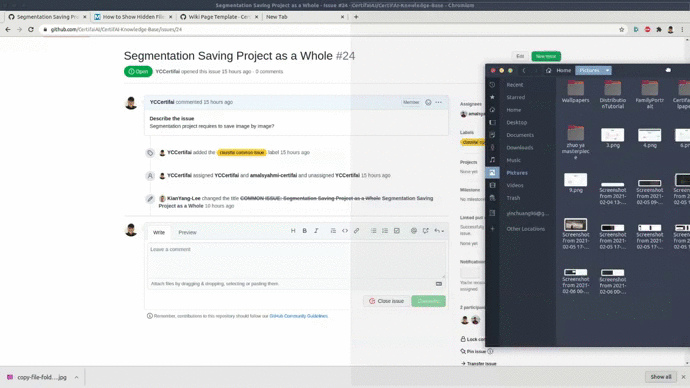
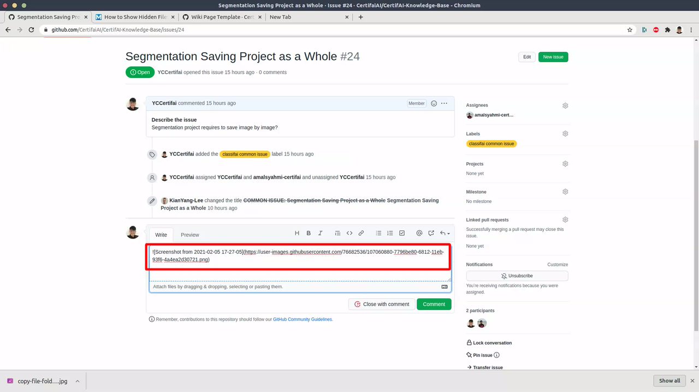

#Upload Media in Wiki
We cannot directly drag the image to the wiki page to import it (like how it does in issue raising). Therefore here's a walkaround for you!
### Step 1: Go to any issue 

### Step 2: Drag the image you wanted to upload to wiki to the comment block to generate a link

### Step 3: You can use the link generated in your wiki page
