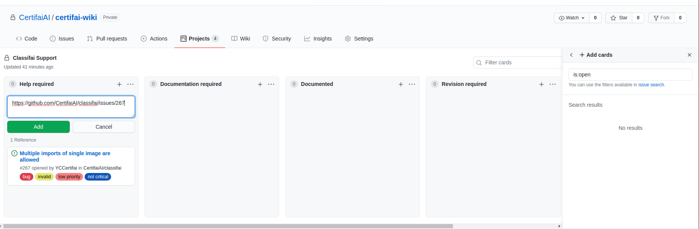

#Instruction of raising a Common Issue
The common issue platform is built to serve the purpose of answering repeatedly asked questions by common users.

Please follow the instuctions while raising an issue. This will ensure the issue raised will be documented and traced properly.

###Raise the issue at the right place
Following links will lead you to the issue template for raising issue. 
- [IntelliJ & DL4J lab]()
- [Computer Vision Lab]()
- [Time Series Lab]()
- [Classifai]()

Provide the information as required in the template.

###Paste the issue link to the project as stated in the template at the right column
There are four columns in each project. Please place them at the right column
- help required
  
Answer is not known by the person who raised the issue. Please tag person you think who may help while raising issue.
- documentation required
  
Issue that are answered but not documented will be placed here. *Person in charged* will do document accordingly.
- documented
  
Issue that are documented in wiki will be placed here.
- revision required

If there are any changes to specific issue that requires revision will be placed here.
Example : documentation is outdated.

  

*How to move project from one column to another*

  

